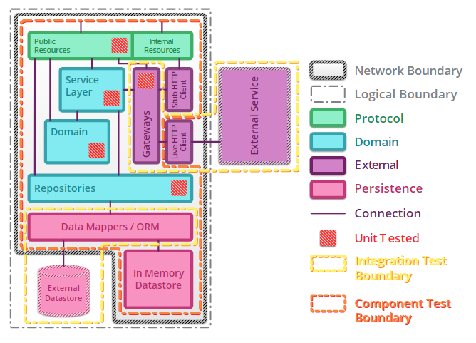
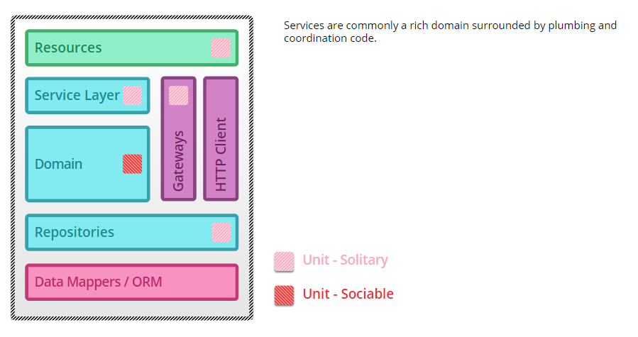

# Unit Testing

<!-- vscode-markdown-toc -->
* 1. [Quick checklist to work on a unit test project.](#Quickchecklisttoworkonaunittestproject.)
* 2. [Be clear about the Unit of work, what to test ?.](#BeclearabouttheUnitofworkwhattotest.)
* 3. [Testing techniques](#Testingtechniques)
	* 3.1. [Solitary unit test](#Solitaryunittest)
	* 3.2. [Sociable unit test](#Sociableunittest)
	* 3.3. [Mix Sociable and Solitary](#MixSociableandSolitary)
	* 3.4. [Known your Test Doubles](#KnownyourTestDoubles)
	* 3.5. [Code coverage](#Codecoverage)
* 4. [Testing project structure](#Testingprojectstructure)
	* 4.1. [Testing project](#Testingproject)
	* 4.2. [Testing classes](#Testingclasses)
	* 4.3. [Testing method](#Testingmethod)
	* 4.4. [Testing pattern](#Testingpattern)
* 5. [References](#References)

<!-- vscode-markdown-toc-config
	numbering=true
	autoSave=true
	/vscode-markdown-toc-config -->
<!-- /vscode-markdown-toc -->

##  1. Quick checklist to work on a unit test project.

1. Having a `clear definition` of `Unit Of work` (or unit to be test). What to test ? the boundary of the testing unit, giving practical examples.
2. Be clear expectation & acceptable level on where to apply `Solitary or Sociable` technique. 
3. Be clear the `goals` of writing unit test. How many test cases `are enough`?.
4. Know your `test doubles` and select the suitable one.
5. Consider `code coverage` as a supporting tool to analyze how much of the source is tested.

**Examples:**

1. Unit under test
   - Presentation Controller Unit
   - Application Service Unit
   - Repository Unit
   - Domain Object Unit
   - Public class library interface unit
   - ...
2. ...

##  2. Be clear about the Unit of work, what to test ?.

`Unit Testing` is the practice of testing a `unit of work` !.

The simple `unit of work` statement would also cause confusing in the real life implementation.

We can say, Unit of work (or unit to be tested) is a single unit of the behavior that we want to test.

Technically, Instead of having one-one mapping between class under test & the testing unit (solitary unit tests).

We can have one unit to span to multiple method or multiple classes (sociable unit test).

They are not mutually exclusive, we can consider to mix them base on our purpose of the testing.
For example: sociable technique for the domain models, solitary technique for the repository,..

However, the most importance part is: the team should be on the same page about unit of work under test, and how to decide them.
Otherwise, we will have a messy unit testing project.

**Maping to the code, a quick identification of a unit of work is an action that (not limited to):**

- It's a public method/interface of the system.
- The result/execution-output can be observed via a noticiable change to the state of the system
- ...

**_For example:_**

- A public method of an object or interface.
- Methods returns a value.
- There is a callout to the external system.

**NOTE 1:** About solitary unit test:

- Unit testing is `not really about 1-1 mapping` between testing classes and class under test (solitary unit test).
- It's ok with 1-1 mapping. However we should aware of mocking hell, where we `unnecessary use the mocking test double`.

**NOTE 2:** About sociable unit test:

- One unit of test `can cover mutiple classes/methods` (sociable unit test).
- There are authors that mention Integration Test as the sociable unit test (in this context It's more about narrow integration test)
- However without the proper rules to organize your testing classes & identify the boundary of tests (e.g good naming convension, know your unit of work,..) we can end up with a messy like:
  - Dupplicated test cases
  - (or) we don't know where to write the test
  - (or) we don't know if a class should be tested as a seperated unit.

See more about Solitary and Sociable Unit Test <a href="https://martinfowler.com/bliki/UnitTest.html">here</a>.

**NOTE 3:** Boundary of Unit testing

(*Source: https://martinfowler.com/articles/microservice-testing*)

##  3. Testing techniques

###  3.1. Solitary unit test

Useful at the adapter or system edge. Anything beyond this service would be a test double.

_Quote from the book Testing Java Microservices:_

    Solitary unit tests focus on testing the unit or work in an isolated and controlled way. The unit’s collaborators are replaced by test doubles or mocks.

    This approach is a great way to avoid test failures that are unrelated to the class under test, but are related to one of its dependencies. This is usually far outside the scope of the test.
    
    Moreover, solitary unit tests are useful in cases where the class under test has a dependency that requires a physical connection to a network, a database, an email service, or even another microservice. Using real dependencies in these cases is a bad thing for two reasons:
    - Access to I/O is a comparatively slow operation, and unit tests should be fast.
    - Remote services are prone to failure at any time (due to server outages, network outages, firewall rules, and so on), and this means a test might fail for reasons other than incorrect code.

    Hence, you should aspire to use solitary unit tests for the following scenarios:
    - When collaborators of the unit under test are slow—This can be due to I/O access, but it could also be due to long-running calculations.
    - When collaborators of the unit under test contain logic that may change often—In this case, the test may fail not because of the class under test, but because one of the collaborators fails.
    - When you want to test corner cases that would be difficult to test using real instances—For example, a disk-is-full test case.

###  3.2. Sociable unit test

Work great at the aggregate/root level. We would limit the use of test doubles as much as possible but still have fast, isolated tests.

_Quote from the book Testing Java Microservices:_

    Sociable unit tests focus on testing the behavior of the class under test along with its dependencies and collaborators by taking into consideration changes in state. Obviously, when using this approach, you’re treating the unit under test as a facade interface where some input is provided. Afterward, the unit under test uses its collaborators to calculate the output, and, finally, the output is validated by an assertion.

    ...

    This approach is a great way to test classes belonging to the business-domain component, where such classes often expose calculations and state transitions.

    Because business-domain objects are representations of real-world concepts, they contain the data of the model and the behavior that changes the state of the model. Domain objects are state-based, and there’s no real value in testing them in an isolated way. For this reason, sociable unit tests are best suited for testing business-domain logic.

###  3.3. Mix Sociable and Solitary
It's not really important to decide if you go for solitary or sociable unit tests. They can be mixed. 

The most importance part is: 
- The team are on the same page on What, where and how to test.
- Having a consistence process.

If it becomes awkward to use real collaborators I will go with solitary approach and use mocks and stubs generously. 

If I feel like involving the real collaborator gives me more confidence in a test I'll go with the sociable approach and only stub the outermost parts of my service.

**Here is an example how to combine them together:**

(*Source: https://martinfowler.com/articles/microservice-testing*)

###  3.4. Known your Test Doubles

Test double is the generic term used when you replace a production object that was coined by Gerard Meszaros in xUnit Test Patterns: Refactoring Test Code.
There are five kinds of test doubles:

- Dummies: A dummy object is passed but never used. It’s just used to fill required method parameters.
- Fakes: A fake object is an implementation of a collaborator, but it takes some shortcuts to make it more performant. Usually, a fake object isn’t suitable for production. A well-known example is the in-memory database.
- Stubs: A stub provides predefined answers to calls made during the test.
- Mocks: A mock is an object with preprogrammed expectations. An expectation can be a discrete value or an exception. Unlike stubs, mocks do runtime behavior verification. No state is stored.
- Spies: A spy object is a stub that records information during the calls to it. For example, an email gateway stub might be able to return all the messages that it “sent.”

###  3.5. Code coverage

Code coverage is a metric that can help you understand how much of your source is tested.
It's a very useful metric that can help you assess the quality of your test suite.

##  4. Testing project structure

The purpose of having a good clean organization is to guarantee the consistency of:

- What to test
- Where to test

###  4.1. Testing project

It should be 1-1 mapping between testing project and project under test. So that, developer can know exactly where to find the testing classes.

**Convention:**

- {ProjectUnderTest}`.UnitTest`

**For example**:

- Project under test:
  - Core.Application
- Testing project:
  - Core.Application`.UnitTest`

###  4.2. Testing classes

It should be 1-1 mapping between testing class and class under test. So that, developers can know exactly where to find the testing classes.

**Convention:**

- {ClassUnderTest}`Test`.cs

**For example**:

- Class under test:
  - Core.Application
    - /Services/ProductServices.cs
- Testing class:
  - Core.Application`.UnitTest`
    - /Services/ProductServices`Test`.cs

###  4.3. Testing method

We should consider to follow the form of Given > When > Then folow with `Given` is the method name. So that, developers can know excatly where to find the testing method.

**Convention:**

- Ideal world:
  - {UnitOfWorkName}\_{ScenarioUnderTest}\_{ExpectedBehavior}.
    - {UnitOfWorkName} can be a method, or a logical group of multiple methods/classes.
- However, personally I prefer this approach for better tracking & consistency within the technical context:
  - {MethodUndertest}\_{ScenarioUnderTest}\_{ExpectedBehavior}
    - In the case of `sociable` unit testing, the {MethodUndertest} is the entry point of the test, where developer can easy to map to the technical context.
  - Also It worths to mention that there should be no rigid naming policy. Choose the convention that the team is comfortable with and easy to manage. 

**Example**:

- Method under test:
  - Core.Application
    - /Services/ProductServices.cs
      - CreateProduct()
- Testing method:
  - Core.Application`.UnitTest`
    - /Services/ProductServices`Test`.cs
      - CreateProduct`_WhenProductNameExists_ShouldThownDupplicatedError`()

###  4.4. Testing pattern

We should consider to follow the AAA pattern, which stand for Arrange, Action, Assert

- Arrange: inputs and targets and preparation to trigger the execution.
- Action: calling the unit/method under test.
- Assert: expected outcomes to tell it pass or fail.

##  5. References

[1] https://martinfowler.com/bliki/UnitTest.html

[2] https://martinfowler.com/bliki/IntegrationTest.html

[3] https://martinfowler.com/articles/practical-test-pyramid.html

[4] https://martinfowler.com/testing/

[5] https://martinfowler.com/articles/microservice-testing

[6] Book: The art of unit testing

[7] Book: 
